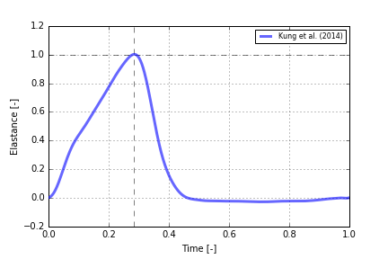

# elastance-function

by Christian Winkler, M.Sc.

This is a study about the elastance function of the left ventricle. I focused on the normalized elastance function which was used in publication about the mechanics of cardiovascular system and heart. I summarized some important papers referring to the elastance function in the following blog post:

[Publications about the elastance function](https://xi2pi.com/elastance-function-of-the-left-ventricle#more-255)

Following figure shows the elastance function that was published by [Kung et al. (2014)](https://www.ncbi.nlm.nih.gov/pmc/articles/PMC5101033/).

You can find the Python script for the function in this repository.

# References

[Kung E, Pennati G, Migliavacca F, et al. 
A Simulation Protocol for Exercise Physiology in Fontan Patients Using a Closed Loop Lumped-Parameter Model. 
ASME. J Biomech Eng. 2014;136(8):081007-081007-13. doi:10.1115/1.4027271](https://www.ncbi.nlm.nih.gov/pmc/articles/PMC5101033/)